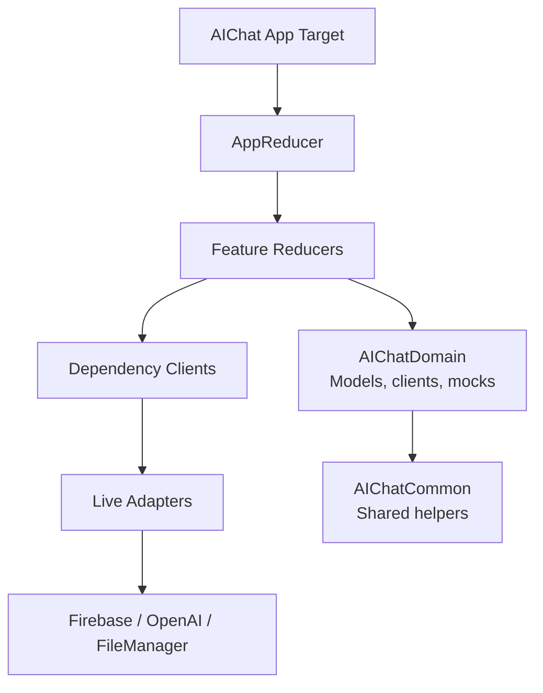
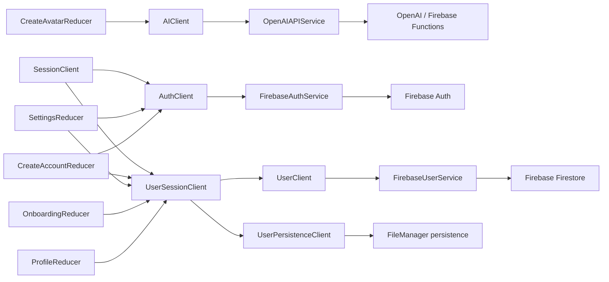

# AIChat

AIChat is an iOS SwiftUI app focused on chat, avatars, onboarding, profile management, and AI-assisted avatar image generation.

This README documents the current modularization and dependency flow after the first migration milestone.

## Tech Stack

- Swift
- SwiftUI
- The Composable Architecture
- Swift Package Manager
- Firebase Auth
- Firebase Firestore
- Firebase Functions
- OpenAI image generation through an app-side adapter
- Swift Testing

## Key Features

- Anonymous sign-in
- Sign in with Apple
- User onboarding
- Profile and settings flow
- Avatar creation
- AI avatar image generation
- Chat UI
- Local current-user persistence
- Remote current-user stream

## Project Structure

```text
AIChat/
├── AIChat/                         # Main app target
│   ├── Autogenerated/              # Generated annotations/helpers
│   ├── Components/                 # Shared SwiftUI components
│   ├── Core/                       # TCA reducers, views, navigation, app flow
│   ├── Extensions/                 # App-side Swift/SwiftUI extensions
│   ├── Services/                   # App-side live adapters and dependency wiring
│   ├── Utilities/                  # Legacy utility location during migration
│   └── Assets.xcassets             # App assets
│
├── AIChatPackage/                  # Local Swift package
│   ├── Sources/
│   │   ├── AIChatCommon/           # Shared helpers with no internal dependencies
│   │   ├── AIChatApi/              # API boundary placeholder
│   │   ├── AIChatDomain/           # Domain models, clients, mocks
│   │   ├── AIChatFeatures/         # Future feature modules
│   │   └── AIChatAppFeature/       # Future app composition module
│   └── Tests/
│       ├── AIChatDomainTests/
│       └── AIChatFeaturesTests/
│
├── AIChatTests/                    # App target tests
├── AIChatUITests/                  # UI tests
└── Docs/                           # Architecture and migration notes
```

## Modularization Goal

The target shape is a local Swift package with strict dependency direction:

```text
AIChat app target
    ↓
AIChatAppFeature
    ↓
AIChatFeatures
    ↓
AIChatDomain
    ↓
AIChatApi
    ↓
AIChatCommon
```

Current migration status:

- `AIChatCommon` exists and contains shared Foundation helpers.
- `AIChatDomain` exists and contains app-facing models and dependency clients.
- App-side live Firebase/OpenAI adapters still live in the main `AIChat` target.
- Feature modules are not moved yet; reducers and views still live in `AIChat/Core`.

## Architecture Flow



Main rule:

```text
Reducer -> Client -> Live adapter
```

Reducers should not call Firebase, OpenAI, FileManager, or concrete service types directly.

## Current Dependency Flow



## Client Pattern

New dependencies should follow this file shape:

```text
FeatureNameClient.swift
FeatureNameClient+Live.swift
FeatureNameClient+Mocks.swift
FeatureNameError.swift
```

For very small clients, the error can stay in the main client file. Split files once the dependency starts mixing contract, live implementation, and mocks.

Client shape:

```swift
struct ExampleClient: Sendable {
    var load: @Sendable () async throws -> Example
    var save: @Sendable (Example) async throws -> Void
}
```

Dependency registration:

```swift
extension ExampleClient: DependencyKey {
    static var liveValue: Self {
        .live()
    }

    static var previewValue: Self {
        .mock()
    }

    static var testValue: Self {
        .unimplemented
    }
}

extension DependencyValues {
    var exampleClient: ExampleClient {
        get { self[ExampleClient.self] }
        set { self[ExampleClient.self] = newValue }
    }
}
```

Reducer usage:

```swift
@Dependency(\.exampleClient)
var exampleClient
```

## Current Clients

### AI

```text
CreateAvatarReducer -> AIClient -> OpenAIAPIService
```

Files:

- `AIChat/Core/CreateAvatar/CreateAvatar.swift`
- `AIChat/Services/AI/Services/AIClient.swift`
- `AIChat/Services/AI/Services/AIClient+Live.swift`
- `AIChat/Services/AI/Services/OpenAIAPIService.swift`

`AIClient` remains in the app target because it returns `UIImage`.

### Auth

```text
CreateAccountReducer / SettingsReducer / SessionClient
    -> AuthClient
    -> FirebaseAuthService
```

Files:

- `AIChatPackage/Sources/AIChatDomain/Auth/AuthClient.swift`
- `AIChatPackage/Sources/AIChatDomain/Auth/AuthClient+Mocks.swift`
- `AIChat/Services/Auth/Services/AuthClient+Live.swift`
- `AIChat/Services/Auth/Services/FirebaseAuthService.swift`

`AuthManager` was removed because it was only a pass-through wrapper.

### User Session

```text
ProfileReducer / OnboardingReducer / SettingsReducer / CreateAccountReducer / SessionClient
    -> UserSessionClient
    -> UserClient
    -> UserPersistenceClient
```

Files:

- `AIChat/Services/User/Services/UserSessionClient.swift`
- `AIChat/Services/User/Services/UserSessionClient+Live.swift`
- `AIChat/Services/User/Services/UserSessionClient+Mocks.swift`
- `AIChat/Services/User/Services/UserSessionError.swift`

`UserSessionClient` owns app-facing current-user orchestration:

- current user cache
- local persistence
- remote user stream
- sign-out cleanup
- account deletion
- onboarding completion

### Session Bootstrap

```text
AppReducer
    -> SessionClient
    -> AuthClient
    -> UserSessionClient
```

Files:

- `AIChat/Core/AppView/AppReducer.swift`
- `AIChat/Services/Session/SessionClient.swift`
- `AIChatPackage/Sources/AIChatDomain/Session/SessionBootstrap.swift`

## Dependency Rules

- Reducers use `@Dependency` for side effects.
- Reducers should depend on clients, not managers.
- Live adapters can import SDKs.
- Domain models and mocks should not require Firebase/OpenAI setup.
- Feature code should not import Firebase or OpenAI.
- `AIChatCommon` must not import internal app modules.

## When To Add A Client

Use a normal client when wrapping one service boundary:

```text
AuthClient -> FirebaseAuthService
AIClient -> OpenAIAPIService
```

Use an orchestration client when behavior combines lower-level dependencies or owns app-facing state:

```text
UserSessionClient -> UserClient + UserPersistenceClient
SessionClient -> AuthClient + UserSessionClient
```

Do not create a manager just to forward calls. If a type only passes methods through, make it a client.

## Prerequisites

- Xcode with iOS simulator support
- Swift Package Manager
- Firebase configuration file in the app target
- Network access for package resolution and Firebase/OpenAI calls

Some package resolution/build operations may fail behind a company firewall or in a restricted sandbox. In that case, resolve dependencies from Xcode or run the build in a normal local environment.

## Validation

Useful checks:

```bash
plutil -lint AIChat.xcodeproj/project.pbxproj
```

```bash
swiftc -typecheck -parse-as-library \
  AIChatPackage/Sources/AIChatDomain/AIChatDomain.swift \
  AIChatPackage/Sources/AIChatDomain/Auth/*.swift \
  AIChatPackage/Sources/AIChatDomain/Avatar/*.swift \
  AIChatPackage/Sources/AIChatDomain/Chat/*.swift \
  AIChatPackage/Sources/AIChatDomain/User/*.swift \
  AIChatPackage/Sources/AIChatDomain/Session/*.swift
```

Full verification should still be done with an Xcode build.

## Next Steps

- Run a full Xcode build outside restricted sandbox/cache environments.
- Move one feature folder into `AIChatFeatures`.
- Move app composition into `AIChatAppFeature`.
- Keep the app target thin.
- Move `AIClient` into `AIChatDomain` only after it returns UI-independent data instead of `UIImage`.
